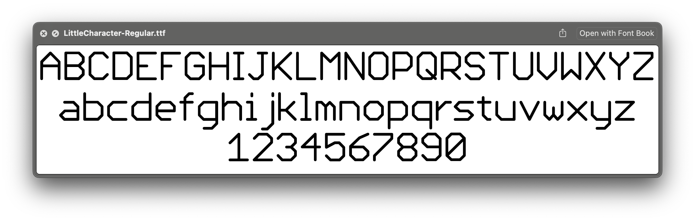

# LittleCharacter

LittleCharacter is a font made in tribute to LITT.CHR.

LittleCharacter was created by Astrid Bin in the spring of 2025. The font design is licensed under the SIL Open Font License (https://openfontlicense.org/), and this software is available under the MIT License (https://mit-license.org/).
